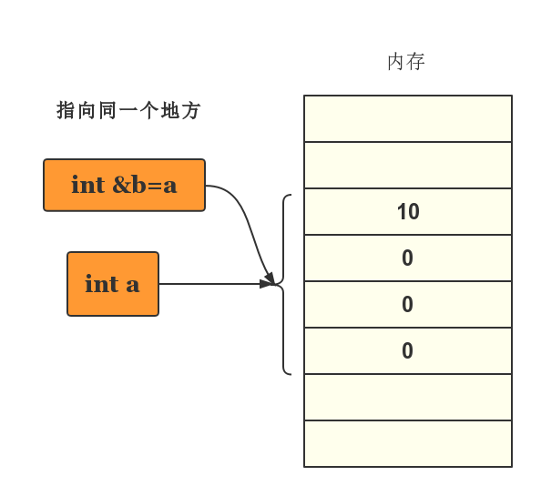

# 引用简介

引用就是某一变量（目标）的一个别名，对引用的操作与对变量直接操作完全一样。

引用的声明方法：`类型标识符 &引用名=目标变量名;`

例:

```c
#include <cstdio>
int main(){
    int a = 10;
    int &b = a;
    printf("%d\n",b);
    return 0;
}
```

## 说明：

**引用的本质:**



 - （1）&在此不是求地址运算，而是起标识作用。
 - （2）类型标识符是指目标变量的类型。
 - （3）声明引用时，必须同时对其进行初始化。
   - `int &a;`单独这样写是不对的
 - （4）引用声明完毕后，相当于目标变量名有两个名称，即该目标原名称和引用名，且不能再把该引用名作为其他变量名的别名。 ra=1; 等价于 a=1;
 - （5）声明一个引用，不是新定义了一个变量，它只表示该引用名是目标变量名的一个别名，它本身不是一种数据类型，因此引用本身不占存储单元，系统也不给引用分配存储单元。故：对引用求地址，就是对目标变量求地址。&ra与&a相等。
 - （6）不能建立数组的引用。因为数组是一个由若干个元素所组成的集合，所以无法建立一个数组的别名。

## 引用应用

### 引用作为参数

```c
#include <cstdio>
void swap(int &p1, int &p2) //此处函数的形参p1, p2都是引用
{ 
    int p; 
    p=p1; 
    p1=p2; 
    p2=p; 
}

//为在程序中调用该函数，则相应的主调函数的调用点处，
//直接以变量作为实参进行调用即可，
//而不需要实参变量有任何的特殊要求。
//如：对应上面定义的swap函数，相应的主调函数可写为：

int main( )
{
    int a,b;
    scanf("%d%d",&a,&b); //输入a,b两变量的值
    swap(a,b); //直接以变量a和b作为实参调用swap函数
    printf("%d %d\n",a,b); //输出结果
    return 0;
}
```
上述程序运行时，如果输入数据10 20并回车后，则输出结果为20 10。

传递引用给函数与传递指针的效果是一样的。这时，被调函数的形参就成为原来主调函数中的实参变量或对象的一个别名来使用，所以在被调函数中对形参变量的操作就是对其相应的目标对象（在主调函数中）的操作。

使用引用传递函数的参数，在内存中并没有产生实参的副本，它是直接对实参操作；而使用一般变量传递函数的参数，当发生函数调用时，需要给 形参分配存储单元，形参变量是实参变量的副本；如果传递的是对象，还将调用拷贝构造函数。因此，当参数传递的数据较大时，用引用比用一般变量传递参数的效 率和所占空间都好。

使用指针作为函数的参数虽然也能达到与使用引用的效果，但是，在被调函数中同样要给形参分配存储单元，且需要重复使用"*指针变量名"的 形式进行运算，这很容易产生错误且程序的阅读性较差；另一方面，在主调函数的调用点处，必须用变量的地址作为实参。而引用更容易使用，更清晰。 如果既要利用引用提高程序的效率，又要保护传递给函数的数据不在函数中被改变，就应使用常引用。
　
## 转载说明:
　
[C++中引用（&）的用法和应用实例](http://www.cnblogs.com/Mr-xu/archive/2012/08/07/2626973.html)
