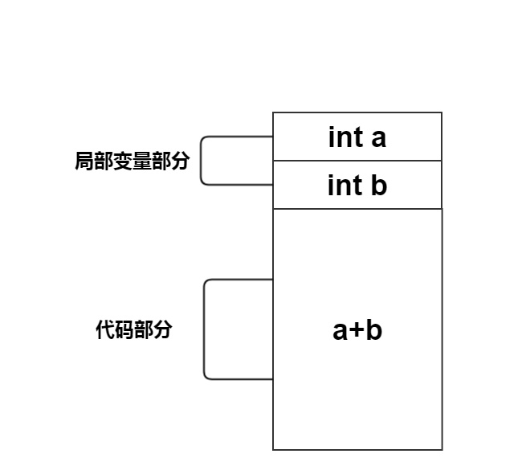
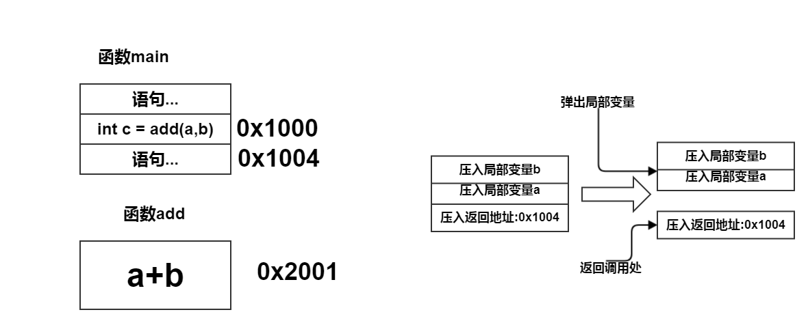

函数执行的过程到底是怎么样的呢?

## 函数运行的过程(模型)

函数为会可以被其它函数调用?函数在被调用的过程中发生了什么?函数在内存是如何存储的?

我们可以这样理解:函数本身其时分为两个部分:

 - 代码部分
 - 局部变量部分

我们知道所有的代码在运行的时候都是在内存中的,如果一个函数被调用(执行)多次,那么是不是有多个**代码部分**存在内存中呢?答案:不是,**代码部分**相当于数学上的公式,而**局部变量部分**相当于代入公式的起始变量,所以如果起始变量不同,面对同样的公式,结果不同.那么为了节省不必要的内存浪费,肯定一个函数**代码部分**在内存中只有一个,但**局部变量部分**有多个.每一次调用函数都会产生一个新的局部变量部分.


我们有如下函数,那么函数`add`是怎么样运行的呢?
```c
#include <cstdio>
int add(int a,int b){
   return a+b;
}

int main(){
   int a =1,b=2;
   int c =add(a,b);
   return 0;
}
```

**函数的内存样式**




**调用栈概念**




### 基于GDB的讲解-视频

```cpp
#include <bits/stdc++.h>
using namespace std;

int calc(int a,int b,int c,int d,int f,int g,int h,int i){
    int sum = a+b+c+d+f+g+h+i;
    return sum;
}

int main(){
    int sum = calc(1,2,3,4,5,6,7,8);
    printf("%d\n",sum);
    return 0;
}
```

利用`gdb -q -tui 1`来调试上面的代码，说明调用的作用,函数如何运行

