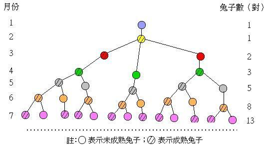
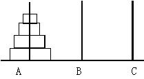

## 1. 斐波那契数列

### 问题

 - 第一个月有一对兔子
 - 第二个月后(第三个月初)它们可以生育一对兔子
 - 以后每个月可以生育的兔子都可以生育一对兔子
 - 兔子不会死去
 - 问每n个月有多少对兔子




或者这样说: 有一组数列$a[i]$,其中$a[0] = 0,a[1] = 1$,$a[i] = a[i-1] + a[i-2]$,问$a[k]$是多少?


::: details Click me to view the code
```cpp
#include <cstdio>

int fab(int n){
    if( n == 1 || n == 2)
        return 1;
    return fab(n-1) + fab(n-2);
}

int main(){
    int n;
    scanf("%d",&n);
    int ans = fab(n);
    printf("%d\n",ans);
    return 0;
}
```
:::


### 拓展

- http://v.youku.com/v_show/id_XMTgwNTIwMTI4.html
- https://www.zhihu.com/question/28062458


## 2. 汉诺塔游戏

### 题目描述

[汉诺塔游戏](http://www.4399.com/flash/676_1.htm)

汉诺塔（tower of Hanoi）问题。有n个大小不等的中空圆盘，按照从小到大的顺序迭套在立柱A上，另有两根立柱B和C。现要求把全部圆盘从A柱移到C柱的过程，移动过程中可借助B柱（中间柱）。

移动时有如下的要求：

 - ①一次只移动一个盘；
 - ②不允许把大盘放在小盘上边；
 - ③可使用任意一根立柱暂存圆盘 

如输入  2

输出

```
    A-->B
    A-->C
    B-->C
```



### 解析


### 代码

::: details Click me to view the code
```cpp
#include <cstdio>

int n; //有几层

// 层数 源  辅助 目的
void hnt(int x,char a,char b,char c){
    if(x == 1) {
        printf("%c --> %c\n",a,c);
        return ;
    }
    hnt(x-1,a,c,b);
    printf("%c --> %c\n",a,c);
    hnt(x-1,b,a,c);
}

int main(){
    scanf("%d",&n);
    hnt(n,'a','b','c');
    return 0;
}
```
:::

### 参考

 - [从汉诺塔问题来看“递归”本质](https://www.cnblogs.com/tgycoder/p/6063722.html)


## 3. 整数划分

### 问题描述

对于一个正整数n的分化，就是把n表示成一系列正整数之和的表达式。注意，分化与顺序无关，例如6=5+1和6=1+5是一样的。N本身也是一个划分。
例如：对于n=6

```
6
5+1
4+2     4+1+1
3+3     3+2+1       3+2+1+1
2+2+2   2+2+1+1     2+1+1+1+1
1+1+1+1+1+1
```
求分化的数目p(n)，显然$p(6) = 11$

### 解析

不知道如何下手，把所有的数据都写一下，找一下规律，找规律是一种很常用的方法。

对于1

```
1
```

对于2

```
2
1+1
```

对于3

```
3
2+1
1+1+1
```

对于4

```
4
3+1
2+2 2+1+1
1+1+1+1
```

对于5

```
5
4+1
3+2 3+1+1
2+2+1 2+1+1+1
1+1+1+1+1
```

对于6

```
6
5+1
4+2     4+1+1
3+3     3+2+1       3+2+1+1
2+2+2   2+2+1+1     2+1+1+1+1
1+1+1+1+1+1
```

对于7

```
7
6+1
5+2 5+1+1
4+3 4+2+1 4+1+1+1
3+3+1 3+2+2 3+2+1+1 3+1+1+1+1
2+2+2+1 2+2+1+1+1 2+1+1+1+1+1
1+1+1+1+1+1+1+1
```
通过对上面的数据的观察， 设$f(n,m)$表示把$n$分解成不超过$m$的分法的数量，可以得到下面的规律。


显示$f(n,1)= 1$

 - $f(n,n) = 1+f(1,n-1) + f(2,n-2)+ \cdots +f(n-1,1)$
 - 当$m>n$时，$f(n,m) = f(n,n)$
 - 当$m<n$时，$f(n,m) = f(n-m,m)+ f(n-(m-1),m-1) + \cdots + f(n-1,1)$

### 代码

::: details Click me to view the code
```cpp
#include <cstdio>

int n;
int dfs(int n,int m){
    if( m > n ) m = n;
    if( m == 1) return 1;
    int ans = 0;
    if( m == n) ans=1,m=n-1;
    for(int i = m ; i>=1;i--){
        int d = dfs(n-i,i);
        ans +=d;
    }
    return ans;
}
int main(){
    scanf("%d",&n);//输入数字
    int ans = dfs(n,n);
    printf("%d\n",ans);
    return 0;
}
```
:::

## 4.其它题目

 - [骨牌覆盖](https://www.cnblogs.com/tjsudys/p/4427861.html)
