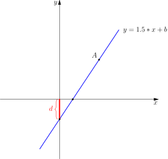

# Slope optimization

[[TOC]]

## 前置知识:线性规划

> 斜率优化的思想其实和高中数学的线性规划有相似之处，因此建议没学过的同学先了解一下线性规划

这个视频讲解了高中的线性规划的相关知识
https://www.bilibili.com/video/BV1qg4y1v7Xy?p=4


一元一次函数:$y = k \cdot x + b$,它的函数图像如下所示




其中$k,b$为定值,$k$为直线的斜率

由图可知如下的事实:

一: 这条直线$l$上的所有点$(x_l,y_l)$都符合:$y_l - k \cdot x_l ==d$或者反过来说:在坐标
轴上所有符合$y - k \cdot x = d$的点会组成一条直线,这条直线就是$l$

二: $B$为直线$l$与$y$轴的交点,同时也是直线$l$上的点,所以$y_B - k \cdot x_B = d$,此时$x_B == 0$,
所以得到:

$$
y_B = d
$$

我们把这个距离称为**截距**.也就是说:直线$l$上的所有点$y_l - k \cdot x_l$的值就是这个截距.


## 入门: 玩具装箱

### 题目描述

P 教授要去看奥运，但是他舍不下他的玩具，于是他决定把所有的玩具运到北京。他使用自己的压缩器进行压缩，其可以将任意物品变成一堆，再放到一种特殊的一维容器中。

P 教授有编号为 $1 \cdots n$ 的 $n$ 件玩具，第 $i$ 件玩具经过压缩后的一维长度为 $C_i$。

为了方便整理，P教授要求：

- 在一个一维容器中的玩具编号是连续的。

- 同时如果一个一维容器中有多个玩具，那么两件玩具之间要加入一个单位长度的填充物。形式地说，如果将第 $i$ 件玩具到第 $j$ 个玩具放到一个容器中，那么容器的长度将为 $x=j-i+\sum\limits_{k=i}^{j}C_k$。

制作容器的费用与容器的长度有关，根据教授研究，如果容器长度为 $x$，其制作费用为 $(x-L)^2$。其中 $L$ 是一个常量。P 教授不关心容器的数目，他可以制作出任意长度的容器，甚至超过 $L$。但他希望所有容器的总费用最小。


### 输入格式
第一行有两个整数，用一个空格隔开，分别代表 $n$ 和 $L$。

第 $2$ 到 第 $(n + 1)$ 行，每行一个整数，第 $(i + 1)$ 行的整数代表第 $i$ 件玩具的长度 $C_i$。


### 输出格式

输出一行一个整数，代表所有容器的总费用最小是多少。


### 样例


输入/输出 # 1

::: oneline
```
5 4
3
4
2
1
4
```

```
1
```
:::


题目地址: [luogu P3195 HNOI2008玩具装箱](https://www.luogu.com.cn/problem/P3195)

根据题目的意思可以很轻松的写出状态转移方程

\begin{equation}
dp[i] = \min\limits_{j < i}\{dp[j] + (sum[i] +i - sum[j]-j-L-1)^2 \}
\end{equation}

其中,$sum[i] = \sum\limits_{1}^{i}{C_k}$,也就是前缀和.显然如果直接按这个方程来做,复杂度为$O(n^2)$

## 方法1 数形结合法

设

```math
\begin{aligned}
k(i) &= sum[i] + i - L -1 \\
X(j) &= sum[j] + j
\end{aligned}
```

则可以得到

```math
\begin{aligned}
dp[i] &= \min\{dp[j]+(k(i) - X(j)) ^2\} \\
&= \min\{dp[j] + k(i)^2 - 2\cdot k(i) \cdot X(j) + X(j)^2\} \\
&= \min\{\fcolorbox{red}{aqua}{$ - 2\cdot k(i) \cdot X(j) + dp[j] + X(j)^2$} + k(i)^2\}
\end{aligned}
```

再设

```math
\begin{aligned}
Y(j)   \quad &= \quad dp[j] + X(j)^2
\end{aligned}
```
因为$k(i)$是定值,所以可以把$k(i)^2$移出来,则得到

```math
dp[i] = \min\{\fcolorbox{red}{aqua}{$ - 2\cdot k(i) \cdot X(j) + Y(j) $}\}  + k(i)^2
```

我们注意到``\fcolorbox{red}{aqua}{$- 2\cdot k(i) \cdot X(j) + Y(j) $}``形如``z = kx+y``,
我们设直线``l(j)``表示为:

```math
l(j) = -2  k(i)\cdot X(j) + Y(j)
```

于是就得到

```math
dp[i] = \min\{\fcolorbox{red}{aqua}{$ l( j ) $}\} + k(i)^2
```

显然我们要求的是``\min\{l(j)\}, 1 \leqslant j < i``,这个公式表示的意思就是: 我们要求直线方程线性规划$l(j)$的最小值

定义域为$j \in [1,i)$之间形成的点集$P:\{(X(1),Y(1)), (X(2),Y(2)), \cdots \}$

对于点集$P$中的每一个点$p$,都会有一条斜率为$k(i)$的直线经过$p$,直线上的点
代入公式$k \cdot x + y$的值一样
,而它们的值就是**截距**


所以我们只需要找到最小的截距


同时,基于上面的公式,我们可以知道以下事实:

- $k(i)$值为正值,且随着$i$单调增加

证明 需要维护一个凸包

凸包上的哪个点是答案

凸包上的如何添加点

所以

我们需要维护一个下凸壳

且壳上的点斜率递增

1. 在壳上找到最优点
2. 在壳上添加新的点


## 更一般的公式推断

我们有一个这样的状态转移方程

$$dp[i]=\min\limits_{j\in[l,r]}\{d(j)+B(i)+X(j) \cdot k(i)\}$$

- $X(j) \cdot k(i)$ 表示既与$i$有关又与$j$有关的项,因为$i$是固定的,通常$X(i)$的值也是定值
- $d(j)$ 表示只与$j$有关的项
- $B(i)$ 表示只与$i$有关的项,因为$i$是固定的,通常这个项的值也是定值

这样就可以看成这样的一条直线的公式

```math
\colorbox{aqua}{ $ l_j \Rarr y = k(i) \cdot x + d(j) $}
```

那可以把原式子写成

\begin{equation}
dp[i]=\min\limits_{j\in[l,r]}\{\colorbox{aqua}{ $l_j(k(i) )$ } \}+d(i)
\end{equation}

所以对于每一个状态$i$,可以得到对应的$k(i)$,那么根据$l_j$就得到了对的值

也就是$l_j$这条直线的**线性规划**


对于本题来说

\begin{equation}
dp[i]=\min\limits_{j\in[l,r]}\{\colorbox{aqua}{ $l_j(k(i) )$ } \}+d(i)
\end{equation}

X(j) 是
K(i) 是

为什么我们需要维护一个下凸壳


? 那么第一个满足条件的P值 如何求解最值,找到第一个斜率大于$k(i)$的点

为什么要维护一个单调队列

单调队列如何添加点

如何得到头(update)


TODO

dp[0]应该是什么值?


## 方法2 : 推理法

## TODO

我需要使用asymoto
画图
所以需要 asymoto的笔记

## 代码1: 朴素

```cpp
#include <ios>
```

## 代码2: 模块

## 参考

- [P3195 [HNOI2008]玩具装箱TOY（斜率优化入门） - hhz6830975 的博客 - 洛谷博客](https://www.luogu.com.cn/blog/hhz6830975/p3195-hnoi2008-wan-ju-zhuang-xiang-toy-xie-shuai-you-hua-ru-men-post)
